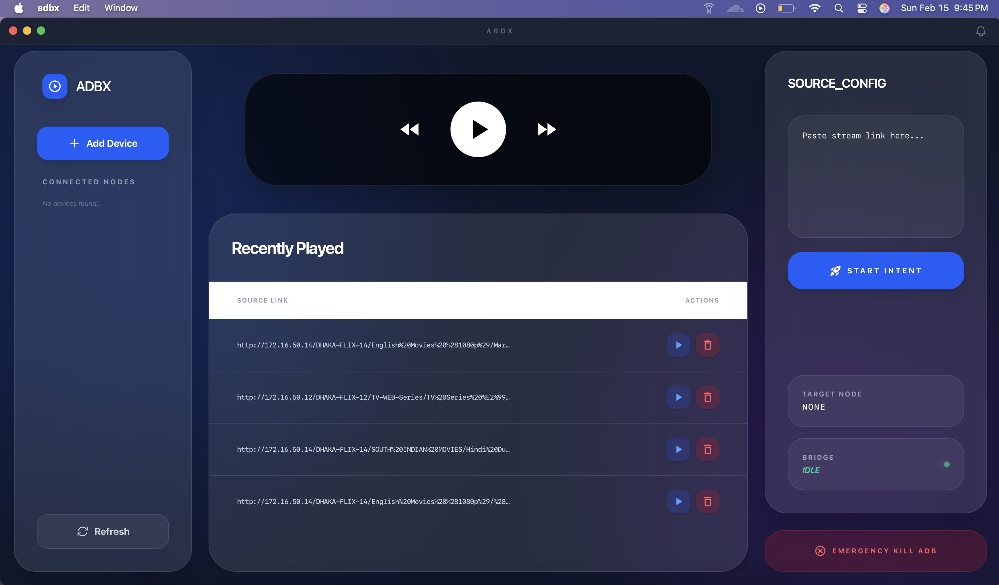

# **ABDx | Android Bridge Data eXchange**


**ABDx** is a sophisticated desktop bridge designed to give you absolute control over Android media environments (Android TV, Tablets, and Phones) directly from your PC. Built with a focus on speed and "Glassmorphism" aesthetics, it transforms your desktop into a powerful remote command center for VLC.

---
## 🖥️ Interface Preview

<p align="center">
  
</p>

---

## **📋 Necessary Requirements**

To ensure **ABDx** functions correctly, your environment must meet the following criteria:

### **1. On Your PC (Host)**
* **ADB (Android Debug Bridge):** ADB must be installed and accessible in your system's `PATH`. The app relies on `adb` commands to communicate with your nodes.
* **Wails Runtime:** (For developers) Ensure Go and the Wails CLI are installed if you are building from source.

### **2. On Your Android Device (Target)**
* **Developer Options Enabled:** You must tap *Build Number* 7 times in your Android settings to unlock developer tools.
* **USB/Wireless Debugging:** * **USB:** For initial connection.
    * **Wireless:** "Wireless Debugging" must be ON to connect via IP Address (Port 5555).
* **VLC for Android:** The target device **must** have the official VLC Media Player installed, as ABDx uses specific Android Intents (`org.videolan.vlc`) to trigger playback.

---

## **📖 User Manual**

### **Step 1: Establishing a Connection**
1.  Open **ABDx**.
2.  Click **"Add Device"** in the left sidebar.
3.  Enter your device's **IP Address** (e.g., `192.168.0.105`).
4.  Click **Connect**. Once the status light turns emerald, you are linked.

### **Step 2: Casting a Stream**
1.  Copy a direct video URL or stream link.
2.  Paste it into the **Source_Config** area on the right panel.
3.  Click **"Start Intent"**. 
4.  The app will force-stop any existing VLC session and launch your new stream with hardware acceleration enabled.

### **Step 3: Playback & Navigation**
* **Center Panel:** Use the iPhone-style circular buttons to Play, Pause, Fast Forward, or Rewind.
* **History Table:** Access your **Recently Played** list. Click the **Play** icon on any row to instantly re-cast that link to your current target node.

### **Step 4: Safety & Emergency**
* If your device is acting up or you want to clear all network bridges, click the red **"Emergency Kill ADB"** button. This will completely reset the ADB server and disconnect all devices.

---

## **✨ Modern UI Features**
* **Glassmorphism:** High-saturation background blurs (50px+) for a premium feel.
* **Draggable Interface:** Drag the window from any non-interactive part of the header.
* **Dynamic Status Monitoring:** Real-time feedback on your connection "Bridge" and node status.
* **Interactive History:** SQLite-backed history management with one-click replay and delete.

---

## **🛠️ Local Development**

```bash
# Install dependencies
npm install (inside the frontend folder)

# Run in dev mode (Hot-Reload)
wails dev

# Build the production binary
wails build
